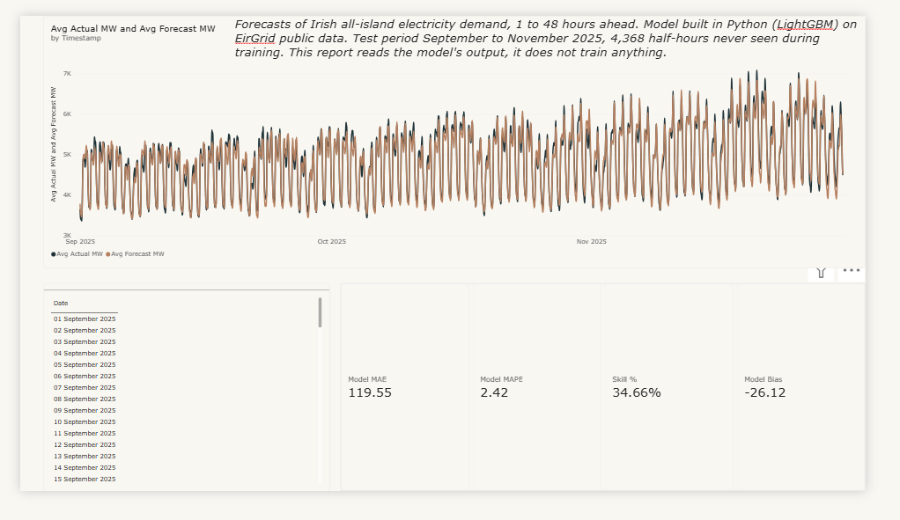
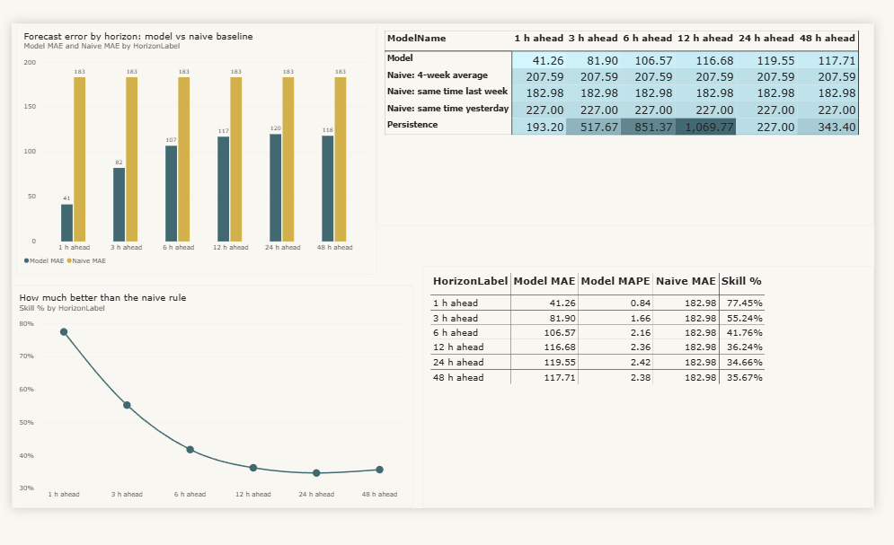
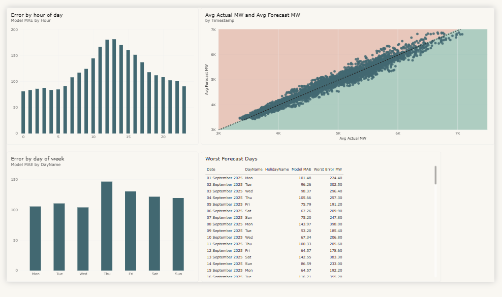

# Irish Grid Demand Forecast

A short-term electricity demand forecaster for the Irish national grid. The project predicts how much power the island will use, in half-hour steps, from one hour to forty-eight hours ahead using EirGrid's publicly available data.

At 24 hours ahead, the model is wrong by **119.6 MW on average**. That is **2.42% of demand** and **34.7% less error** than the operational rule of thumb used as the main benchmark.



## Why demand forecasting matters

Electricity is unlike almost any other product because it cannot be stored at national scale. Whatever Ireland consumes at six o'clock this evening has to be generated at six o'clock this evening. Generation and consumption must match continuously, second by second. If they drift apart, grid frequency moves; if it moves far enough, equipment disconnects to protect itself. That is what a blackout is.

Batteries help, but Ireland's batteries hold a few hundred megawatts for a few hours against a system that runs between roughly 3,000 and 7,500 MW all day. They are a shock absorber, not a warehouse.

Power stations also cannot be switched on instantly. A gas plant takes hours to come up to pressure and synchronise with the grid. The generation that will match tomorrow's demand therefore has to be committed before tomorrow's demand is known.

If the forecast is too low, generation must be bought at short notice from fast-start plants or imported through interconnectors, often at a high price. In the worst case, supply has to be cut to customers. If the forecast is too high, plants are started unnecessarily and still have to be paid for. Both directions cost money every day.

This is a documented operational problem. The Single Electricity Market Operator's *Short-Term Demand Forecasting Methodology for Scheduling and Dispatch* describes a Load Predictor that produces one-minute demand forecasts out to four hours ahead. Those forecasts feed Real-Time Commitment, which decides which generators to start, and Real-Time Dispatch, which tells them what to produce. Every grid operator runs some version of this process; the industry name is load forecasting.

## The evaluation question

Electricity demand is unusually predictable. It has a strong daily shape, a strong weekly shape, and a seasonal shape on top. A simple rule already performs well: assume that next Tuesday at 8am will look like last Tuesday at 8am. In this data, that rule is wrong by about 183 MW on average.

That makes an accuracy number on its own easy to misread. Reporting "2.42% error" sounds impressive but says little without a baseline. The useful question is how much better a real model is than the obvious rule, and when that advantage disappears. This project is designed to answer that question.

## What the project does

The pipeline:

1. Downloads three years of half-hourly demand history from EirGrid's public feed.
2. Builds calendar, lag, rolling, and baseline features using only information that would have been available when each forecast was made.
3. Trains one LightGBM model for each forecast horizon from 1 to 48 hours.
4. Scores every model against four naive forecasting rules.
5. Publishes the results as a self-contained web dashboard and Power BI data extracts.

The dashboard is rebuilt by a scheduled GitHub Actions job. The Power BI report uses the same output, arranged so that users can filter results by date, horizon, weekday, holiday status, and other dimensions.

## Results

The models were trained on 42,327 half-hours beginning in January 2023 and tested on 4,368 half-hours from September to November 2025 that were not seen during training.

| Horizon | Model error | Error as % of demand | Same time last week | 4-week average | Improvement |
| --- | ---: | ---: | ---: | ---: | ---: |
| 1 hour | **41.3 MW** | 0.84% | 183.0 MW | 207.6 MW | **77.5%** |
| 3 hours | **81.9 MW** | 1.66% | 183.0 MW | 207.6 MW | **55.2%** |
| 6 hours | **106.6 MW** | 2.16% | 183.0 MW | 207.6 MW | **41.8%** |
| 12 hours | **116.7 MW** | 2.36% | 183.0 MW | 207.6 MW | **36.2%** |
| 24 hours | **119.6 MW** | 2.42% | 183.0 MW | 207.6 MW | **34.7%** |
| 48 hours | **117.7 MW** | 2.38% | 183.0 MW | 207.6 MW | **35.7%** |



### What the results show

**The advantage falls away quickly, then levels off.** At one hour ahead, the last observed reading is extremely valuable and the model is nearly four times better than the weekly baseline. By six hours, most of that value is gone. From twelve hours onward, the 12-, 24-, and 48-hour results are within 3 MW of one another. Past about half a day, the model is relying mainly on the calendar.

**The 48-hour score being slightly better than the 24-hour score is noise, not evidence that longer forecasts are easier.** The difference is about 2 MW on an error of roughly 118 MW. At 48 hours, some lag features also align with the same clock time two days earlier more cleanly than the 24-hour features do.

**Error is concentrated in the middle of the day.** Error is about 181 MW at 1pm versus 81 MW at midnight. Overnight demand is close to deterministic; daytime demand depends more on weather, industrial activity, and behaviour. There is currently no weather data in the model, making temperature the clearest next improvement.

**The forecast is biased low by about 26 MW on average.** That is small relative to system demand, but important to monitor because under-forecasting is usually the more expensive direction operationally.



The diagnostics page shows where the model fails rather than only reporting an
overall score. Error peaks around midday, the highest-demand points tend to sit
on the under-forecast side of the scatter, and Thursday is the worst weekday in
this test set. I do not have a strong explanation for Thursday yet; keeping
that unexplained result visible is more useful than pretending the model has
identified a cause.

## How it works

```text
EirGrid Smart Grid Dashboard service
   |
   | fetch_history.py -> src/gridcast/eirgrid.py
   | download month by month, retrying through throttling
   v
data/raw/<region>/<series>/<year>-<month>.parquet
   |
   | src/gridcast/features.py
   | resample, add calendar features, build forecast-time-safe lags
   v
one row per period to be forecast
   |
   | src/gridcast/model.py + src/gridcast/baselines.py
   | LightGBM, one model per horizon, scored against naive rules
   v
results/
   |
   | scripts/build_dashboard.py + scripts/export_for_powerbi.py
   v
dashboard.html                          powerbi/
```

### Data collection

EirGrid publishes demand, wind output, total generation, and SNSP at 15-minute resolution through a JSON endpoint behind its public dashboard. The endpoint has no formal public API documentation and throttles aggressively.

The data client is deliberately resumable:

- requests retry with exponential backoff;
- successfully downloaded months are cached as Parquet files;
- the current month is not cached because it is still changing;
- failed months are logged and skipped rather than terminating the run; and
- missing months are retried with a longer pause between sweeps.

The experiment runner finds the longest continuous run of well-covered months before training. This prevents a gap in the raw history from silently corrupting lagged features that cross it.

### Preventing future leakage

At time $t$, a forecast for time $t+h$ may use only information available at or before $t$. This is easy to violate accidentally. For example, `demand.shift(48)` is a lag from the target timestamp, not necessarily from the time the forecast was made. At a 12-hour horizon, that can expose observations from after the forecast time.

The feature builder therefore shifts lags by `horizon + lag`, not merely by the lag. `tests/test_no_leakage.py` uses a series of unique values so every feature can be traced to its source timestamp. The tests verify that:

- feature timestamps are never after the forecast time;
- the raw target is excluded;
- other series measured at the target time are excluded;
- rolling windows do not overlap the target period; and
- chronological train, validation, and test splits do not overlap.

The explicit `known_future_columns` allowlist is the only exception. It is for values genuinely published in advance, such as an operator's wind forecast.

### Modelling choices

- **One model per horizon:** recent observations dominate at one hour ahead, while calendar structure dominates at 24 hours. These are different problems.
- **LightGBM:** gradient-boosted trees suit this tabular dataset, train quickly, and provide readable feature importance.
- **L1 loss:** the model minimises the same absolute-error quantity reported in the results.
- **Chronological splits:** the data is never shuffled, avoiding temporal interpolation between neighbouring observations.
- **Baselines as features:** weekly and four-week rules are available at forecast time, so the model can correct them instead of rediscovering them.


The most valuable next improvements are:

1. **Weather features:** add temperature or heating degree days using forecast values that were genuinely available at prediction time.
2. **Wind benchmarking:** compare against EirGrid's own published wind forecast once coverage is sufficient, and test for systematic bias.
3. **Prediction intervals:** train quantile models and measure actual interval coverage rather than returning only a point forecast.
4. **Rolling-origin backtesting:** retrain monthly and evaluate across the full history to test stability across seasons and operating conditions.
5. **Holiday analysis and monitoring:** measure holiday-specific error and add input drift, accuracy, and forecast-bias alerts.

## Repository layout

```text
fetch_history.py            Bulk download with caching and retries

src/gridcast/
  eirgrid.py                API client, retries, and caching
  features.py               Resampling, calendar features, and lags
  baselines.py              Naive rules and error metrics
  model.py                  LightGBM models, one per horizon

scripts/
  run_experiment.py         Train models and write results/
  build_dashboard.py        Build dashboard.html from results/
  dashboard_template.html   Dashboard source template
  export_for_powerbi.py     Write Power BI CSV extracts

tests/test_no_leakage.py    Future-leakage and split-safety tests
results/                    Scores, predictions, and feature importance
powerbi/                    Star-schema CSVs and screenshots
dashboard.html              Published self-contained dashboard
```

The main Python code is in `fetch_history.py`, `src/gridcast/`, and
`scripts/`. Start with `src/gridcast/features.py` when reviewing the project:
it contains the forecast-time feature construction and the safeguards against
future leakage.

## Technology

Python, pandas, and NumPy power the data work. LightGBM provides the models, PyArrow provides Parquet storage, and pytest covers the safety-critical feature logic. Power BI provides the report; GitHub Actions handles scheduled retraining; and GitHub Pages hosts the dashboard. The dashboard is hand-written HTML, CSS, and SVG so it remains a single self-contained file.

## Skills demonstrated

- Time-series feature engineering with forecast-time-safe lags and rolling windows
- Leakage prevention and chronological train, validation, and test splits
- Gradient-boosted modelling with LightGBM and baseline benchmarking
- Resilient API ingestion with retries, caching, and resumable downloads
- Data preparation with pandas, NumPy, and Parquet
- Automated testing with pytest
- Reproducible reporting through a self-contained dashboard and Power BI extracts
- Scheduled retraining and publishing with GitHub Actions and GitHub Pages

## Data source

EirGrid Smart Grid Dashboard data for all-island system demand at 15-minute resolution, resampled to half-hourly intervals. Public holidays come from the `holidays` Python package using the Ireland calendar.

The client also collects wind output, EirGrid's published wind forecast, total generation, and SNSP. The current demand model uses demand features; wind is available for future experiments when coverage is sufficient.
